<p align="center">
  
</p>

<h1 align="center">Terono</h1>

<p align="center">A fast, customizable Discord theme and Vencord plugin by <b>Terona Studios</b>.</p>

<p align="center">
  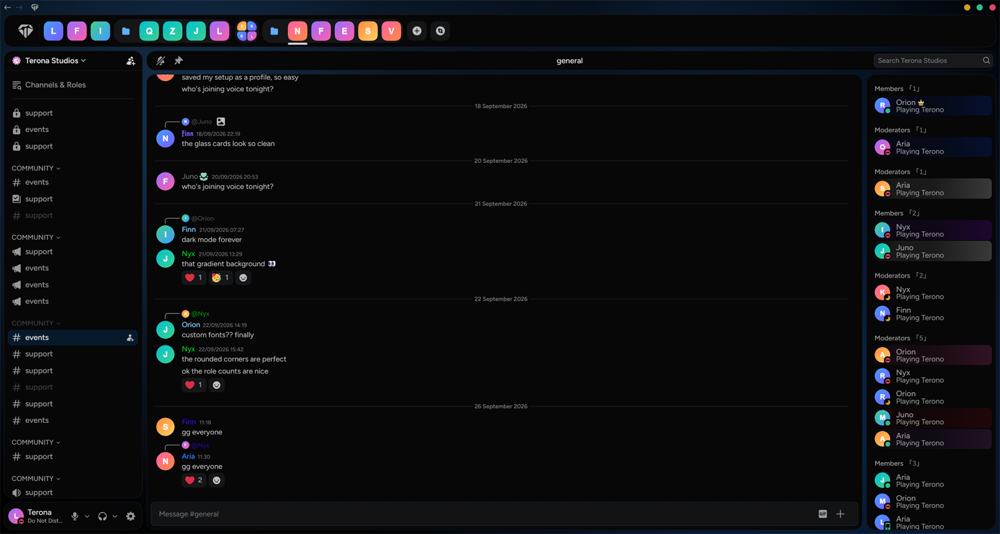
</p>

| Glass | White | Settings |
| --- | --- | --- |
| 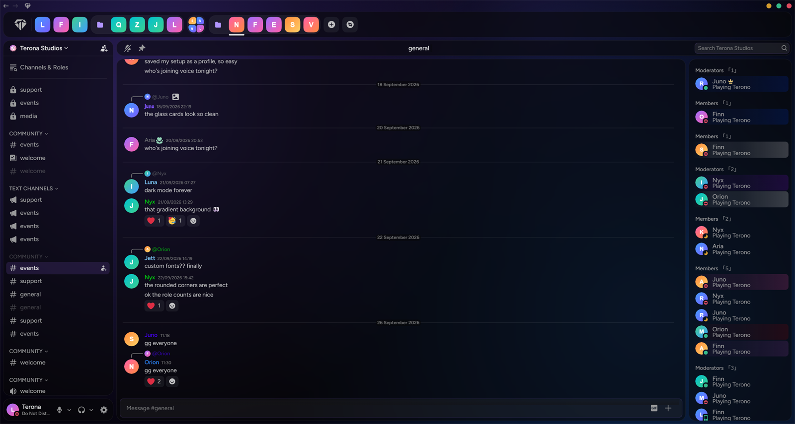 | 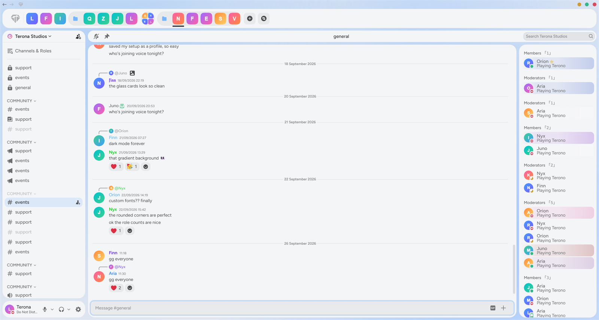 |  |

<details>
<summary><b>More looks</b> (layouts, colors, cards and fonts)</summary>

<br>

| | |
| --- | --- |
| 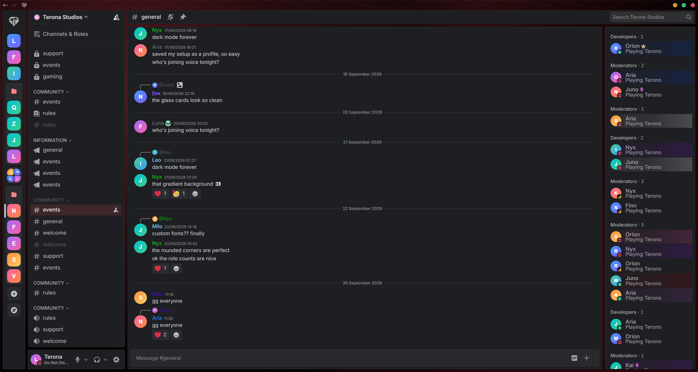 | 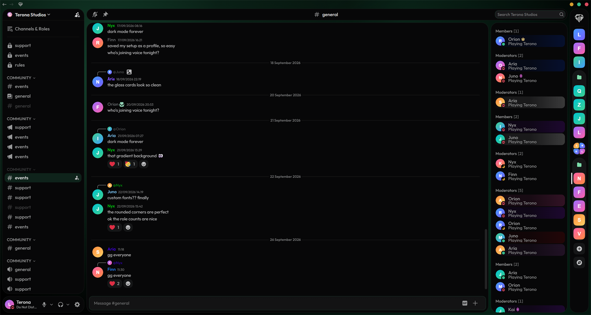 |
| **Red · Sharp:** gray cards with sharp corners, server list on the left, Inter font, `Role · 1` counts | **Green · Right:** round cards, server list on the right, channel name centered, Outfit font, `Role [1]` counts |
| 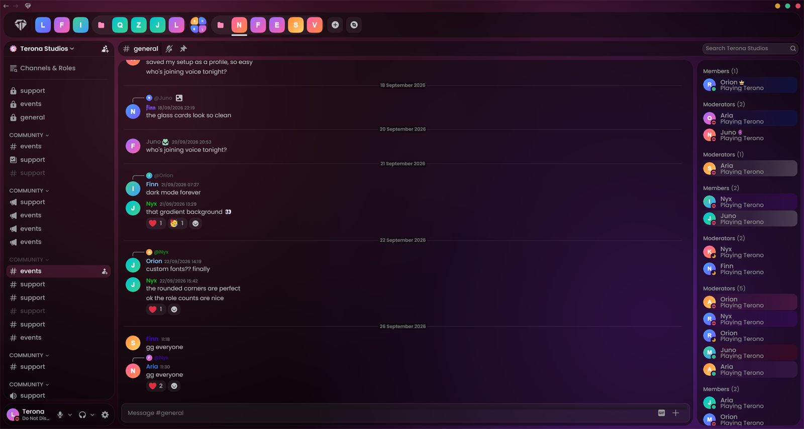 | 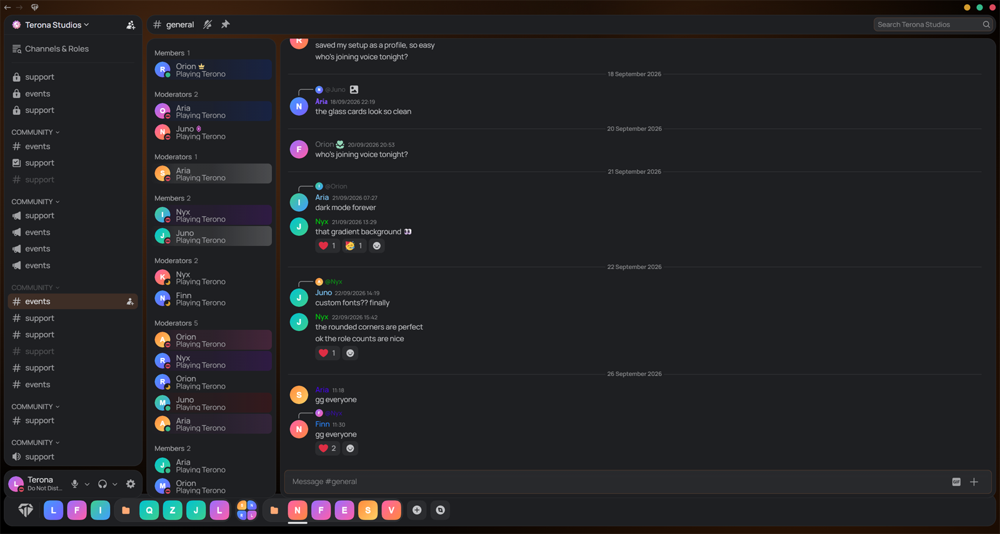 |
| **Pink · Glass:** see-through glass cards at 50%, round corners, Poppins font | **Orange · Bottom:** server list at the bottom, member list moved next to the channels, Manrope font |
| 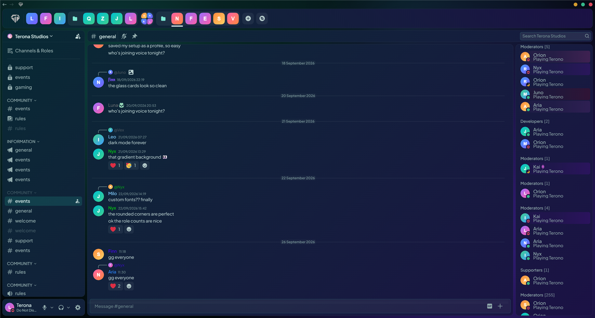 | 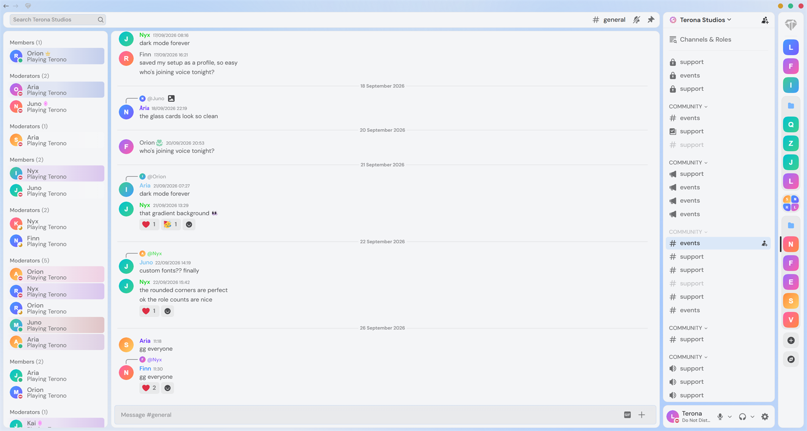 |
| **Custom gradient:** your own card colors (teal → indigo here), custom primary color, Plus Jakarta Sans | **White · Mirrored:** white cards, everything flipped: servers and channels right, members left, search left |
| 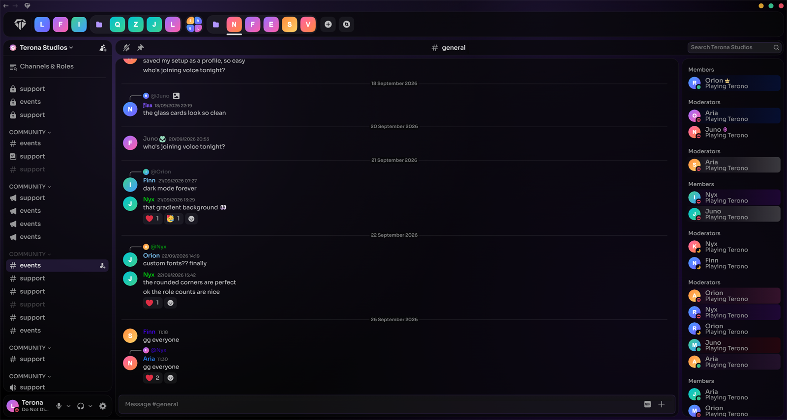 | 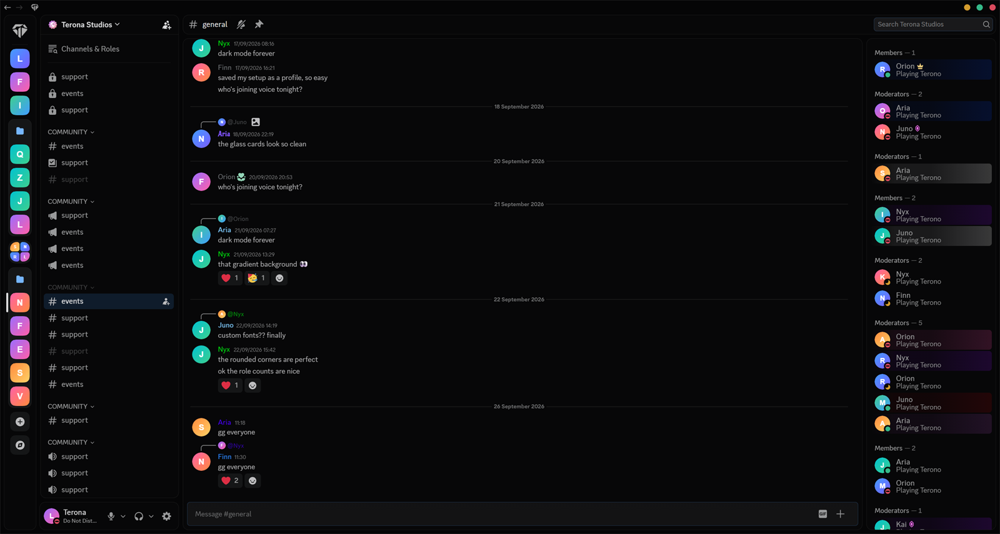 |
| **Purple · Centered:** glass at 70% without blur, channel name in the middle, role counts hidden, Sora font | **Minimal:** solid black background, Discord's own font, server list on the left, `Role — 1` counts |

Every one of these is just a few clicks in **Settings → Vencord → Plugins → Terono**, and you can save each as a profile to switch between them.

</details>

---

## Install

### Windows: download and double-click

1. Download **[Install-Terono.cmd](https://github.com/Terona-Studios/Terono/releases/latest/download/Install-Terono.cmd)**.
2. Double-click it. If Windows shows "Windows protected your PC", click **More info → Run anyway**.
3. Wait until it says *Terono is installed*. Discord closes and reopens by itself.

That's it. Open **Settings → Vencord → Plugins → Terono** to customize everything. To update later, run the same file again.

<details>
<summary>Prefer a command? (Windows PowerShell, macOS, Linux)</summary>

**Windows** (PowerShell):

```powershell
irm https://raw.githubusercontent.com/Terona-Studios/Terono/main/install.ps1 | iex
```

**macOS / Linux** (terminal):

```bash
curl -fsSL https://raw.githubusercontent.com/Terona-Studios/Terono/main/install.sh | bash
```

</details>

**What the installer does:** installs Git and Node.js if they're missing (Windows via winget, macOS via Homebrew), builds Vencord with the Terono plugin in a `Terono` folder in your home directory, installs it into Discord and turns on the plugin and theme. Your existing Vencord settings, themes and plugins are kept.

> Why an installer? Vencord only runs third-party plugins from a build made on your own PC. The installer does that for you.

### Theme only (no plugin)

Works on normal Vencord, no installer needed:

1. **Settings → Vencord → Themes → Online Themes**
2. Paste this link and save:

```
https://cdn.jsdelivr.net/gh/Terona-Studios/Terono@main/theme/Terono.theme.css
```

**BetterDiscord:** download [Terono.theme.css](https://github.com/Terona-Studios/Terono/releases/latest/download/Terono.theme.css) and put it in your BetterDiscord `themes` folder.

## What you can customize (plugin)

- **Profiles:** save your setup or parts of it, switch between looks, export and import them as files, reset to defaults.
- **Colors:** primary color (presets or any color), voice/online color, window button colors.
- **Cards:** Dark, Gray, White or Custom (solid or gradient). Sharp, Soft, Curved or Round corners. Solid or glass, with opacity and blur.
- **Background:** animated gradient, static gradient, solid color, or your own image, GIF or video.
- **Fonts:** 22 built-in fonts or your own font file.
- **Layout:** server list left, top, bottom or right. Channel list and member list/profile on either side.
- **Channel header:** name, buttons and search placed left, middle or right, separately for servers and DMs. Hide any header button.
- **Chat bar:** pick which buttons show (translate, GIF, emoji, sticker, gift, apps).
- **Member list:** role count style, e.g. `Role (1)`, `Role · 1`, or your own format with `%users%`.
- **Right-click menus:** hide any item by its name.
- **Activities:** hide "Start an Activity" everywhere.
- **Quick settings button** next to the back/forward arrows.
- **Plugin hub:** turn on and set up related Vencord plugins (MessageLogger, ShowHiddenChannels, PinDMs and more) from one place.
- **Performance mode** for slower PCs.

## Updating

Run the install command again. Or, if you installed by hand:

```bash
git -C src/userplugins/terono pull
npx pnpm build
```

## Manual install

```bash
git clone https://github.com/Vendicated/Vencord
cd Vencord
git clone https://github.com/Terona-Studios/Terono src/userplugins/terono
npx pnpm install --frozen-lockfile
npx pnpm build
npx pnpm inject
```

Restart Discord, enable **Terono** in Vencord → Plugins and add the theme link above.

## Privacy

Terono only talks to these services, and only for the features that use them:

- **Google Translate:** only with *Auto-translate* turned on (off by default). The text of received messages is sent for translation.
- **DuckDuckGo:** website icons for "domain" connections on profiles.
- **Google Fonts:** when you pick a font other than Discord's own or Figtree.
- **jsDelivr:** serves the theme file.

Your uploaded logos, fonts and backgrounds stay on your PC.

## Notes

- Discord renames its internal class names now and then. If something looks off after a Discord update, update Terono.
- Some options match Discord's English labels (like hiding header buttons by name), so they work best with Discord set to English.

## License

[GPL-3.0](LICENSE). Third-party parts and their licenses are listed in [THIRD_PARTY_LICENSES.md](THIRD_PARTY_LICENSES.md).
