<p align="center">
  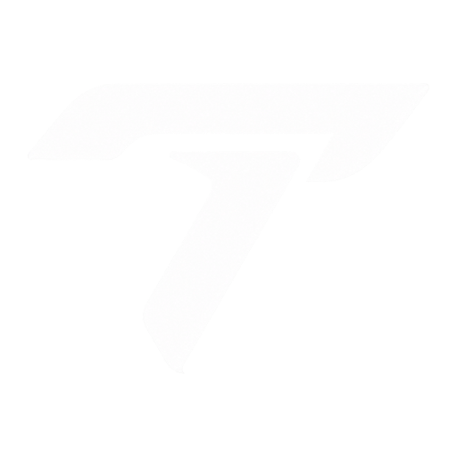
</p>

<h1 align="center">Terono</h1>

<p align="center">A fast, customizable Discord theme and Vencord plugin by <b>Terona Studios</b>.</p>

<p align="center">
  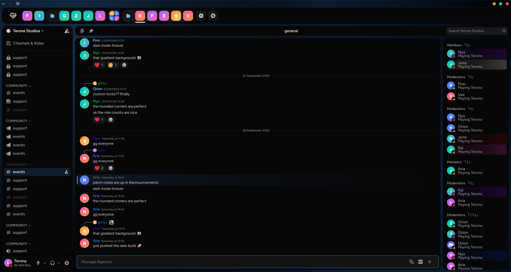
</p>

## Theme presets

Every look below is a preset: **Settings → Vencord → Plugins → Terono → Presets → Apply**. Click **Preview** to try one on your own Discord first (flip through them, then **Keep** or **Go back**). **Apply** offers **Theme + layout** for the exact look in the picture, or **Only the theme** to keep your own layout. You can change anything afterwards.

| | |
| --- | --- |
| 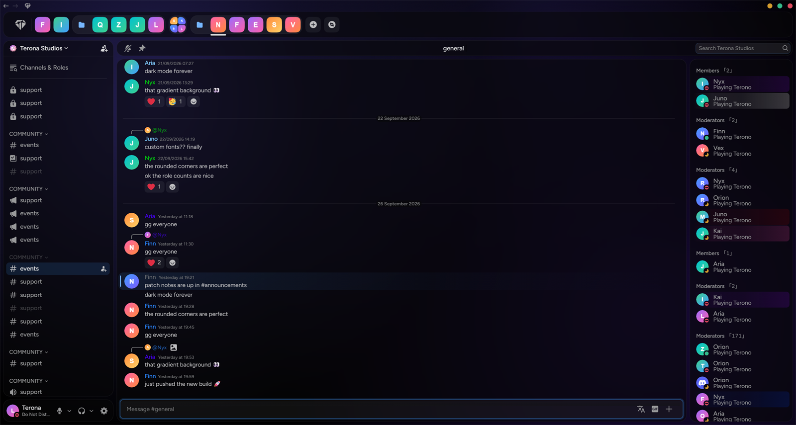 | 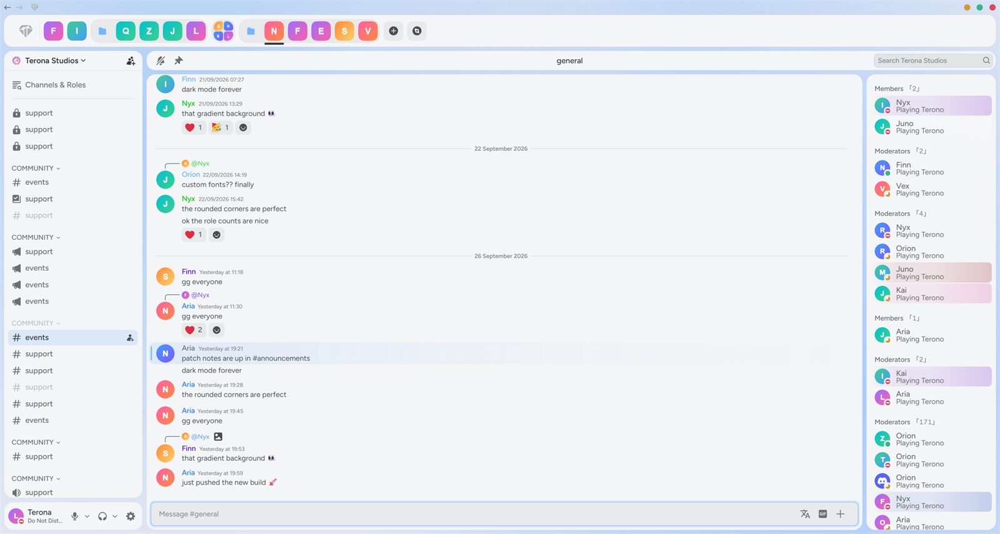 |
| **Frosted Glass:** see-through blurred cards over a blue-violet glow | **Paper White:** light cards on a soft blue-gray background |
| 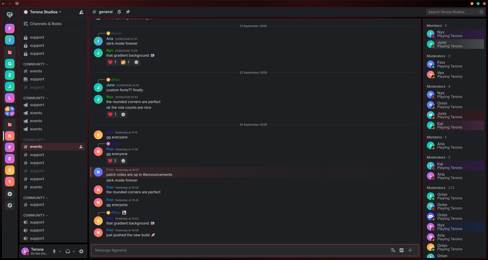 | 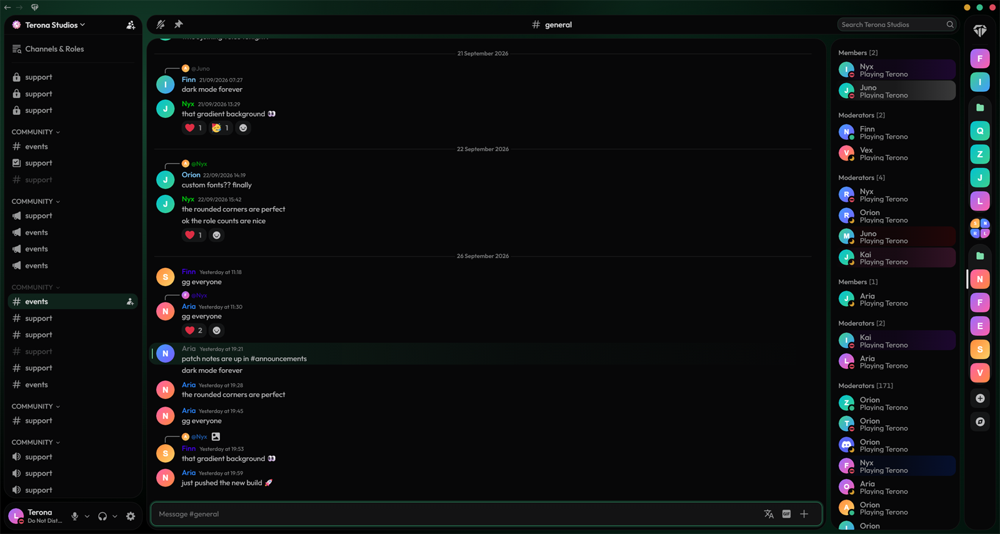 |
| **Crimson Edge:** red, gray cards with sharp corners, server list on the left, Inter | **Emerald:** green, round cards, server list on the right, centered title, Outfit |
| 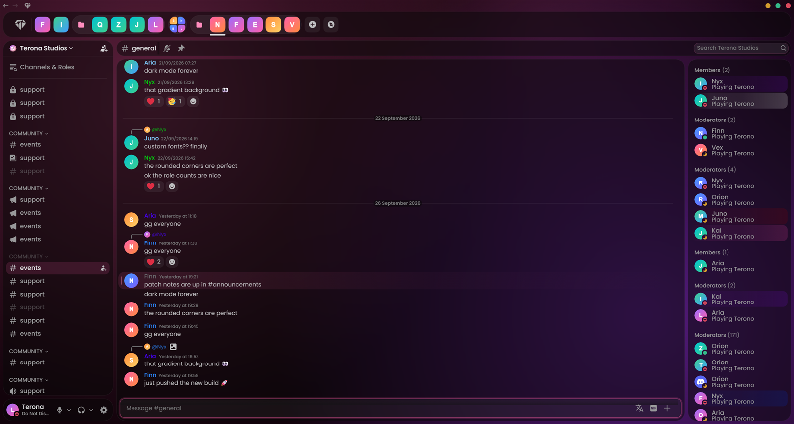 | 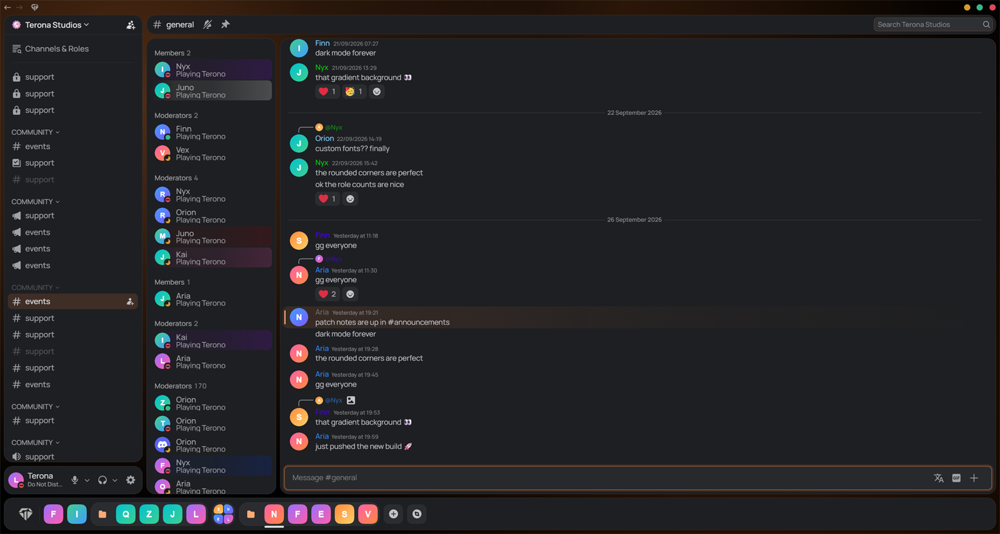 |
| **Sakura Glass:** pink glass cards with round corners, Poppins | **Amber Dock:** server list at the bottom, members next to the channels, Manrope |
| 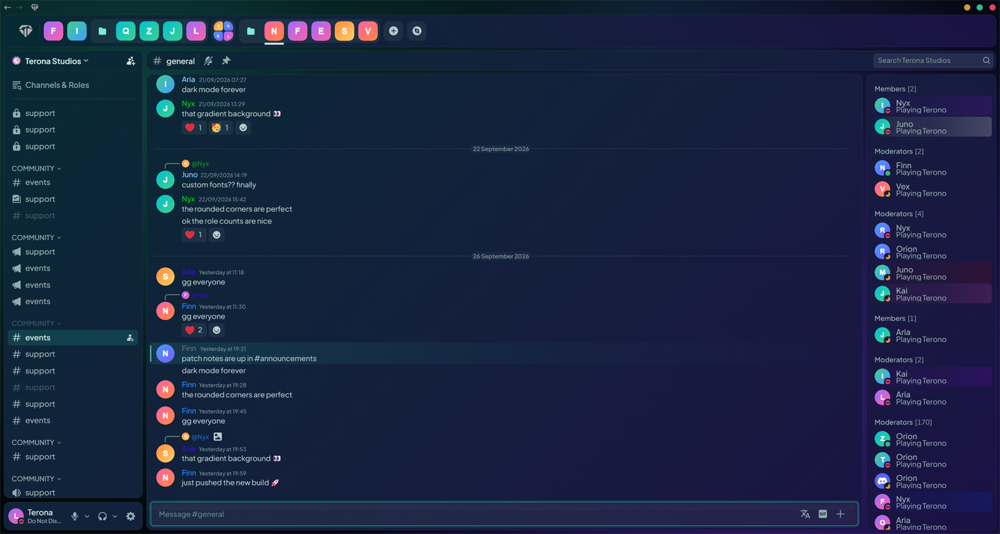 | 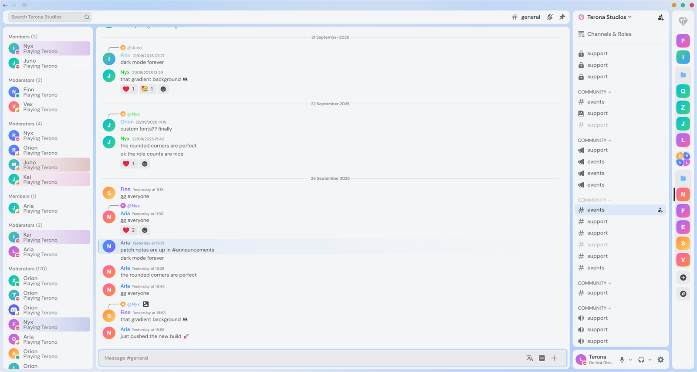 |
| **Deep Lagoon:** teal to indigo gradient cards, teal accent, Plus Jakarta Sans | **Mirror White:** white cards, everything mirrored: servers and channels right, members left |
| 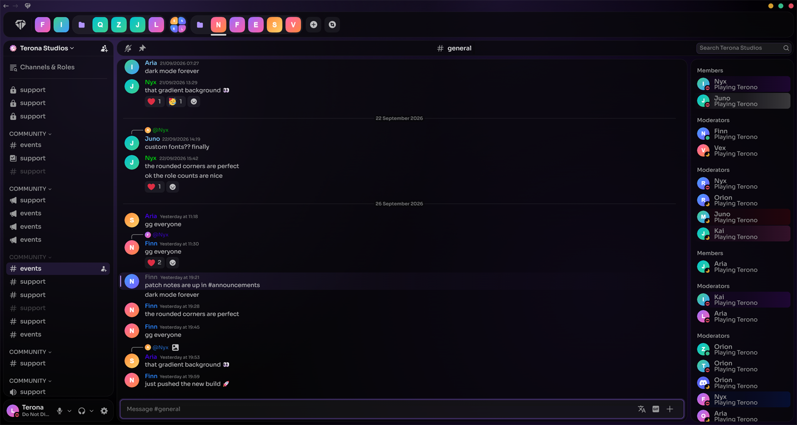 | 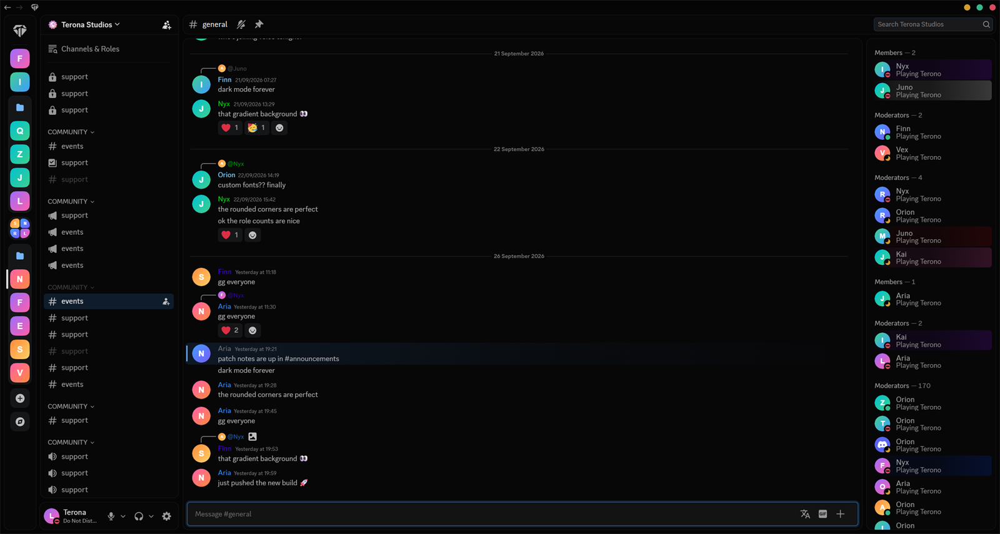 |
| **Violet Focus:** purple glass without blur, centered channel name, no role counts, Sora | **Minimal:** solid black, soft corners, server list on the left, Discord's own font |

The big picture at the top is **Terono Classic**.

<p align="center">
  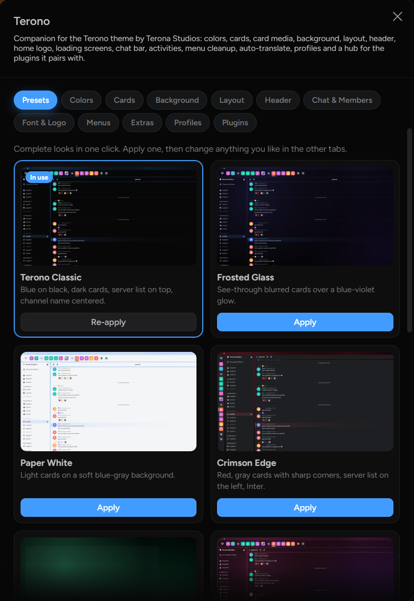
</p>

---

## Install

> New to this? The **[step-by-step tutorial](docs/TUTORIAL.md)** covers installing, every setting, profiles, updating, troubleshooting and uninstalling.

### Windows: download and double-click

1. Download **[Terono-Setup.exe](https://github.com/Terona-Studios/Terono/releases/latest/download/Terono-Setup.exe)**.
2. Double-click it. The file isn't code-signed yet, so Windows may show *"Windows protected your PC"*: click **More info → Run anyway**.
3. Wait until it says *Terono is installed*. Discord closes and reopens by itself.

That's it. Open **Settings → Vencord → Plugins → Terono** to customize everything. To update later, run the same file again.

Terono Setup is a small open-source program by Terona Studios (right-click → **Properties → Details** shows it). Its whole source is in [installer/](installer/). It only runs git, Node.js and Vencord's own installer, and writes what it does to `%TEMP%\Terono-Setup.log`.

<details>
<summary>macOS / Linux</summary>

In a terminal:

```bash
curl -fsSL https://raw.githubusercontent.com/Terona-Studios/Terono/main/install.sh | bash
```

</details>

**What the installer does:** installs Git and Node.js if they're missing (Windows via winget, macOS via Homebrew), builds Vencord with the Terono plugin in a `Terono` folder in your home directory, installs it into Discord and turns on the plugin and theme. Your existing Vencord settings, themes and plugins are kept.

> Why an installer? Vencord only runs third-party plugins from a build made on your own PC. The installer does that for you.

### Browser (Chrome, Brave, Edge, Opera, Firefox)

1. Download **[Terono-Chromium.zip](https://github.com/Terona-Studios/Terono/releases/latest/download/Terono-Chromium.zip)** and unzip it (Firefox: **[Terono-Firefox.zip](https://github.com/Terona-Studios/Terono/releases/latest/download/Terono-Firefox.zip)**, see the [tutorial](docs/TUTORIAL.md#firefox)).
2. Open your browser's extensions page (`chrome://extensions`, `brave://extensions`, `edge://extensions`…) and turn on **Developer mode**.
3. If you have the normal Vencord extension, switch it off (Terono's already includes Vencord).
4. Click **Load unpacked**, pick the unzipped folder and refresh [discord.com/app](https://discord.com/app).

Terono and its theme turn on by themselves.

### Theme only (no plugin)

Works on normal Vencord, no installer needed:

1. **Settings → Vencord → Themes → Online Themes**
2. Paste this link and save:

```
https://cdn.jsdelivr.net/gh/Terona-Studios/Terono@main/theme/Terono.theme.css
```

**BetterDiscord:** download [Terono.theme.css](https://github.com/Terona-Studios/Terono/releases/latest/download/Terono.theme.css) and put it in your BetterDiscord `themes` folder.

## What you can customize (plugin)

- **Theme presets:** 11 complete looks in one click, with a live preview. Customize them afterwards.
- **Profiles:** save your setup or parts of it, switch between looks, export and import them as files, reset to defaults.
- **Colors:** primary color (presets or any color), text color, icon color, voice/online color, window button colors.
- **Cards:** Dark, Gray, White or Custom (solid or gradient). Sharp, Soft, Curved or Round corners. Solid, glass, or **liquid glass** (blurred glass with light slowly flowing over it).
- **Embeds:** link previews in one color, a gradient or glass, separately from the cards.
- **Card media:** your own image, GIF or video inside the panels, separate from the background.
- **Background:** animated gradient, static gradient, solid color, or your own image, GIF or video.
- **Fonts:** 22 built-in fonts (each shown in its own style in the list) or your own font file.
- **Layout:** server list left, top, bottom or right (top and bottom can run right to left). Channel list and member list/profile on either side.
- **Channel header:** name, buttons and search placed left, middle or right, separately for servers and DMs. Hide any header button.
- **Chat bar:** pick which buttons show (translate, GIF, emoji, sticker, gift, apps).
- **Member list:** role count style, e.g. `Role (1)`, `Role · 1`, or your own format with `%users%`.
- **Right-click menus:** hide any item by its name.
- **Activities:** hide "Start an Activity" everywhere.
- **Quick settings button** next to the back/forward arrows.
- **Loading screens:** Terono logo and "Terono Discord" while Discord starts, updates and connects.
- **Updates inside Discord:** check for a new version, update and restart without leaving Discord.
- **Plugins:** every Vencord plugin in one place, sorted by category, with search. Switch them on and off instantly and set them up. Ones that need a restart are listed under Updates.
- **Badges:** everyone who uses Terono 1.0.5 – 1.1.5 gets the **Terono OG** badge. Add up to 3 badges of your own (any image, with a glow or outline in any color) and wear Discord's badges. Only people with Terono see them, and changes show up for everyone instantly.
- **Ctrl + 1** opens the Terono settings from anywhere (can be turned off).
- **Performance mode** for slower PCs.

## Found a bug?

Report it on the Terona Studios Discord: **[teronastudios.com/discord](https://teronastudios.com/discord)**. The link is also at the top of the Terono settings. Add the info from **Extras → Troubleshooting → Copy debug info** and a screenshot: it shows your versions and what Terono found, so the problem can be fixed.

## Updating

**In Discord:** Settings → Vencord → Plugins → Terono → **Check for updates** at the top. When a new version is out, click **Update**, wait for the update screen to finish and click **Restart Discord**. Terono also checks by itself when Discord starts and shows a notification.

Or run **Terono-Setup.exe** again (macOS / Linux: the install command). If you installed by hand:

```bash
git -C src/userplugins/terono pull
npx pnpm build
```

## Manual install

```bash
git clone https://github.com/Vendicated/Vencord
cd Vencord
git clone https://github.com/Terona-Studios/Terono src/userplugins/terono
npx pnpm install --frozen-lockfile
npx pnpm build
npx pnpm inject
```

Restart Discord, enable **Terono** in Vencord → Plugins and add the theme link above.

## Privacy

Terono only talks to these services, and only for the features that use them:

- **Google Translate:** only with *Auto-translate* turned on (off by default). The text of received messages is sent for translation.
- **DuckDuckGo:** website icons for "domain" connections on profiles.
- **Google Fonts:** when you pick a font other than Discord's own or Figtree.
- **jsDelivr:** serves the theme file.

Your uploaded logos, fonts and backgrounds stay on your PC.

## Notes

- Discord renames its internal class names now and then. If something looks off after a Discord update, update Terono.
- Some options match Discord's English labels (like hiding header buttons by name), so they work best with Discord set to English.

## License

[GPL-3.0](LICENSE). Third-party parts and their licenses are listed in [THIRD_PARTY_LICENSES.md](THIRD_PARTY_LICENSES.md).
